# Project 2: Multi-Agent Search
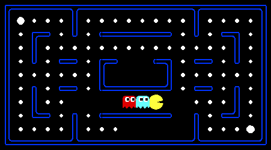

In this project, the student is proposed to design agents for the classic version of Pacman, including ghosts implementing both minimax and expectimax search algorithms and make the evaluation function.

This project includes an autograder for you to grade your answers on your machine. This can be run on all questions with the command:
```bash
python autograder.py
```
It can be run for one particular question, such as q2, by:
```bash
python autograder.py -q q2
```

It can be run for one particular test by commands of the form:
```bash
python autograder.py -t test_cases/q2/0-small-tree
```

During the assignment all the code we have to implement is in `multiagents.py`

## 1.Reflex Agent
We have to improve the ReflexAgent in multiAgents.py to play respectably. The provided reflex agent code provides some helpful examples of methods that query the GameState for information. A capable reflex agent will have to consider both food locations and ghost locations to perform well. The agent should easily and reliably clear the testClassic layout:
```bash
python pacman.py -p ReflexAgent -l testClassic
```

Try out your reflex agent on the default mediumClassic layout with one ghost or two (and animation off to speed up the display):
```bash
python pacman.py --frameTime 0 -p ReflexAgent -k 1
```
or 
```bash
python pacman.py --frameTime 0 -p ReflexAgent -k 2
```

The Reflex agent's evaluation function is implemented in `multiAgents.py` as `evaluationFunction(currentGameState, action)`.

```python
successorGameState = currentGameState.generatePacmanSuccessor(action)
newPos = successorGameState.getPacmanPosition()
newFood = successorGameState.getFood()
newGhostStates = successorGameState.getGhostStates()
newScaredTimes = [ghostState.scaredTimer for ghostState in newGhostStates]

foodlist = newFood.asList()
score = successorGameState.getScore()

if len(foodlist) > 0:
	minFoodDist = float('inf')
	for f in foodlist:
		dist = manhattanDistance(newPos, f)
		if dist < minFoodDist:
			minFoodDist = dist
	FoodPoint = 1.0 / (minFoodDist + 1)
else:
	FoodPoint = 0.0

stop = 0.0
if action == Directions.STOP:
	stop = -2.0

ghostPoint = 0.0
for i, ghostState in enumerate(newGhostStates):
	ghostPos = ghostState.getPosition()
	dist = manhattanDistance(newPos, ghostPos)
	scaredTime = newScaredTimes[i]
	if scaredTime > 0:
		ghostPoint += 2.0 / (dist + 1)
	else:
		if dist <= 1:
			ghostPoint -= 200.0
		else:
			ghostPoint -= 2.0 / (dist if dist > 0 else 1.0)

foodLeft = -0.3 * len(foodlist)
value = score + 10.0 * FoodPoint + ghostPoint + foodLeft + stop
return value
```

- **What the function needs:** successor state after taking `action`, Pacman position `newPos`, remaining food `newFood`, ghost states and scared timers.
- **Food heuristic:** finds the closest food and gives an inverse-distance bonus `FoodPoint = 1/(d+1)`. This is amplified by a multiplier `10.0` so moving toward food is strongly encouraged.
- **Stop penalty:** choosing `Stop` gets a small negative penalty (`-2.0`) to discourage doing nothing.
- **Ghost handling:**
  - If a ghost is scared (scared timer > 0) it contributes a positive small bonus proportional to `2/(dist+1)`, encouraging Pacman to chase scared ghosts.
  - If a ghost is not scared and is very close (`dist <= 1`) a large negative penalty (`-200.0`) is applied to avoid imminent death.
  - Otherwise, non-scared ghosts subtract a small amount `-2/dist` so nearer ghosts reduce the score more than far ghosts.
- **Remaining food penalty:** `-0.3 * number_of_food` slightly biases the agent toward states with fewer pellets remaining.
- **Final combination:** the function sums the environment score plus weighted features: `score + 10*FoodPoint + ghostPoint + foodLeft + stop`.

Rationale: the weights are chosen to prioritize staying alive (huge negative penalty for very close ghosts), move toward the nearest food (strong positive weight), and clear food overall (small penalty per remaining food). Scared ghosts are treated as opportunities.

## 2. Minimax

The minimax, which runs under the motivating assumption that the opponent we face behaves optimally, and will always perform the move that is worst for us. To introduce this algorithm, we must first formalize the notion of terminal utilities and state value. The value of a state is the optimal score attainable by the agent which controls that state. In order to get a sense of what this means, observe the following trivially simple Pacman game board:


Assume that Pacman starts with 10 points and loses 1 point per move until he eats the pellet, at which point the game arrives at a terminal state and ends. We can start building a game tree for this board as follows, where children of a state are successor states just as in search trees for normal search problems:

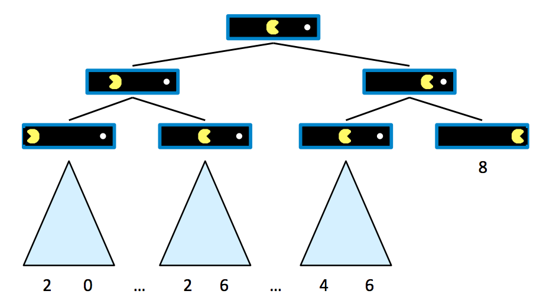

It’s evident from this tree that if Pacman goes straight to the pellet, he ends the game with a score of 8 points, whereas if he backtracks at any point, he ends up with some lower valued score. Now that we’ve generated a game tree with several terminal and intermediary states, we’re ready to formalize the meaning of the value of any of these states.

A state’s value is defined as the best possible outcome (utility) an agent can achieve from that state. We’ll formalize the concept of utility more concretely later, but for now it’s enough to simply think of an agent’s utility as its score or number of points it attains. The value of a terminal state, called a terminal utility, is always some deterministic known value and an inherent game property. In our Pacman example, the value of the rightmost terminal state is simply 8, the score Pacman gets by going straight to the pellet. Also, in this example, the value of a non-terminal state is defined as the maximum of the values of its children. Defining V(s)
as the function defining the value of a state s, we can summarize the above discussion:

***∀non-terminal states,V(s)=maxs′∈successors(s)V(s′) ∀terminal states,V(s)=known***

This sets up a very simple recursive rule, from which it should make sense that the value of the root node’s direct right child will be 8, and the root node’s direct left child will be 6, since these are the maximum possible scores the agent can obtain if it moves right or left, respectively, from the start state. It follows that by running such computation, an agent can determine that it’s optimal to move right, since the right child has a greater value than the left child of the start state.

Let’s now introduce a new game board with an adversarial ghost that wants to keep Pacman from eating the pellet.


The rules of the game dictate that the two agents take turns making moves, leading to a game tree where the two agents switch off on layers of the tree that they “control”. An agent having control over a node simply means that node corresponds to a state where it is that agent’s turn, and so it’s their opportunity to decide upon an action and change the game state accordingly. Here’s the game tree that arises from the new two-agent game board above:

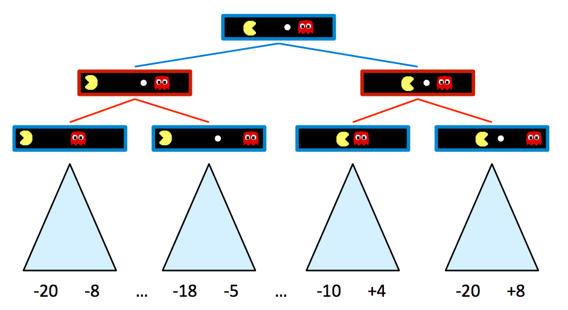

Blue nodes correspond to nodes that Pacman controls and can decide what action to take, while red nodes correspond to ghost-controlled nodes. Note that all children of ghost-controlled nodes are nodes where the ghost has moved either left or right from its state in the parent, and vice versa for Pacman-controlled nodes. For simplicity purposes, let’s truncate this game tree to a depth-2 tree, and assign spoofed values to terminal states as follows:

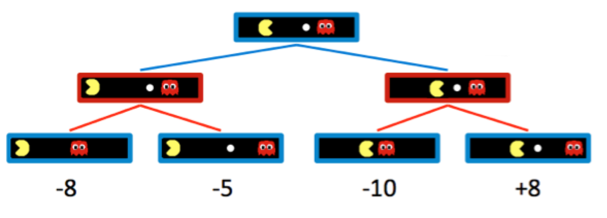


Naturally, adding ghost-controlled nodes changes the move Pacman believes to be optimal, and the new optimal move is determined with the minimax algorithm. Instead of maximizing the utility over children at every level of the tree, the minimax algorithm only maximizes over the children of nodes controlled by Pacman, while minimizing over the children of nodes controlled by ghosts. Hence, the two ghost nodes above have values of min(−8,−5)=−8 and min(−10,+8)=−10 respectively. Correspondingly, the root node controlled by Pacman has a value of max(−8,−10)=−8. Since Pacman wants to maximize his score, he’ll go left and take the score of −8 rather than trying to go for the pellet and scoring −10. This is a prime example of the rise of behavior through computation - though Pacman wants the score of +8 he can get if he ends up in the rightmost child state, through minimax he “knows” that an optimally-performing ghost will not allow him to have it. In order to act optimally, Pacman is forced to hedge his bets and counterintuitively move away from the pellet to minimize the magnitude of his defeat. We can summarize the way minimax assigns values to states as follows:

***∀agent-controlled states,V(s)=maxs′∈successors(s)V(s′)***
***∀opponent-controlled states,V(s)=mins′∈successors(s)V(s′)***
***∀terminal states,V(s)=known***

In implementation, minimax behaves similarly to depth-first search, computing values of nodes in the same order as DFS would, starting with the leftmost terminal node and iteratively working its way rightwards. More precisely, it performs a postorder traversal of the game tree. The resulting pseudocode for minimax is both elegant and intuitively simple, and is presented below. Note that minimax will return an action, which corresponds to the root node’s branch to the child it has taken its value from.

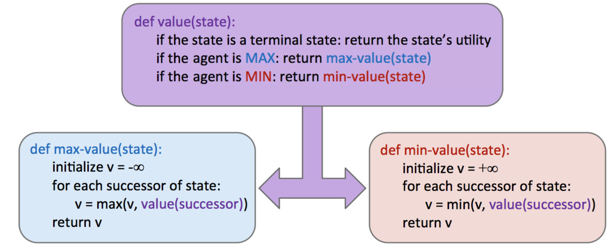

Now is to write an adversarial search agent in the provided MinimaxAgent class stub in multiAgents.py. The minimax agent should work with any number of ghosts, so the ideia is to write an algorithm that is slightly more general. In particular, the minimax tree will have multiple min layers (one for each ghost) for every max layer.

The code should also expand the game tree to an arbitrary depth. The leaves of the minimax tree should be scored with the supplied self.evaluationFunction, which defaults to scoreEvaluationFunction. MinimaxAgent extends MultiAgentSearchAgent, which gives access to self.depth and self.evaluationFunction. The minimax code has to reference to these two variables where appropriate as these variables are populated in response to command line options.

A single search is considered to be one Pacman move and all the ghosts’ responses, so depth 2 search will involve Pacman and each ghost moving two times (see diagram below).

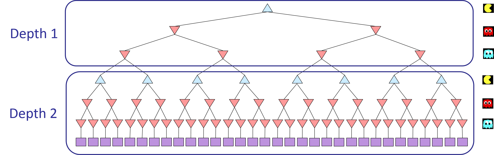

The `MinimaxAgent` in `multiAgents.py` implements a depth-limited adversarial search where Pacman is the maximizing agent and each ghost is a minimizing agent. The implementation handles an arbitrary number of ghosts and uses `self.evaluationFunction` at leaf nodes or terminal states.

```python
def getAction(self, gameState: GameState):
	numGhots = gameState.getNumAgents() - 1
	return self.maximize(gameState, 1, numGhots)

def maximize(self, gameState, depth, numGhosts):
	if gameState.isWin() or gameState.isLose():
		return self.evaluationFunction(gameState)
	maxValue = float("-inf")
	best_move = Directions.STOP

	for action in gameState.getLegalActions(0):
		successor = gameState.generateSuccessor(0, action)
		temp = self.minimize(successor, depth, 1, numGhosts)
		if temp > maxValue:
			maxValue = temp
			best_move = action

	if depth > 1:
		return maxValue
	return best_move

def minimize(self, gameState, depth, agentIndex, numGhosts):
	if gameState.isWin() or gameState.isLose():
		return self.evaluationFunction(gameState)

	minValue = float("inf")
	legalActions = gameState.getLegalActions(agentIndex)
	successors = [gameState.generateSuccessor(agentIndex, action) for action in legalActions]

	if agentIndex == numGhosts:
		if depth < self.depth:
			for successor in successors:
				minValue = min(minValue, self.maximize(successor, depth + 1, numGhosts))
		else:
			for successor in successors:
				minValue = min(minValue, self.evaluationFunction(successor))
	else:
		for successor in successors:
			minValue = min(minValue, self.minimize(successor, depth, agentIndex + 1, numGhosts))
	return minValue
```

- Top-level: `getAction` computes `numGhosts = gameState.getNumAgents() - 1` and calls `maximize(..., depth=1, ...)`. At the root `maximize` returns an action (the chosen `best_move`).

- Maximize nodes (Pacman): evaluate every Pacman action, call `minimize` on each successor, and choose the action with the highest returned value. For recursive calls `maximize` returns numeric values.
- Minimize nodes (ghosts): for each ghost (by `agentIndex`) iterate legal actions and compute successors. If it's the last ghost, either recurse back to `maximize` (incrementing `depth`) or use `evaluationFunction` if the depth limit is reached. Otherwise, continue minimizing for the next ghost.
- Depth convention: `depth` counts Pacman plies. The code only increments `depth` after all ghosts have moved and control returns to Pacman. The search stops at `self.depth` (using the evaluation function at leaves).
- Leaf evaluation: terminal states (win/lose) immediately use `self.evaluationFunction`. Non-terminal leaf nodes at the depth limit also use the same evaluation function.

The minimax agent will often win (665/1000 games for us) despite the dire prediction of depth 4 minimax.
```bash
  python pacman.py -p MinimaxAgent -l minimaxClassic -a depth=4
```

When Pacman believes that his death is unavoidable, he will try to end the game as soon as possible because of the constant penalty for living. Sometimes, this is the wrong thing to do with random ghosts, but minimax agents always assume the worst:
```bash
  python pacman.py -p MinimaxAgent -l trappedClassic -a depth=3
```

## 3. Alpha-Beta Pruning

Conceptually, alpha-beta pruning is this: if you’re trying to determine the value of a node n by looking at its successors, stop looking as soon as you know that n’s value can at best equal the optimal value of n’s parent. Let’s unravel what this tricky statement means with an example. Consider the following game tree, with square nodes corresponding to terminal states, downward-pointing triangles corresponding to minimizing nodes, and upward-pointing triangles corresponding to maximizer nodes:

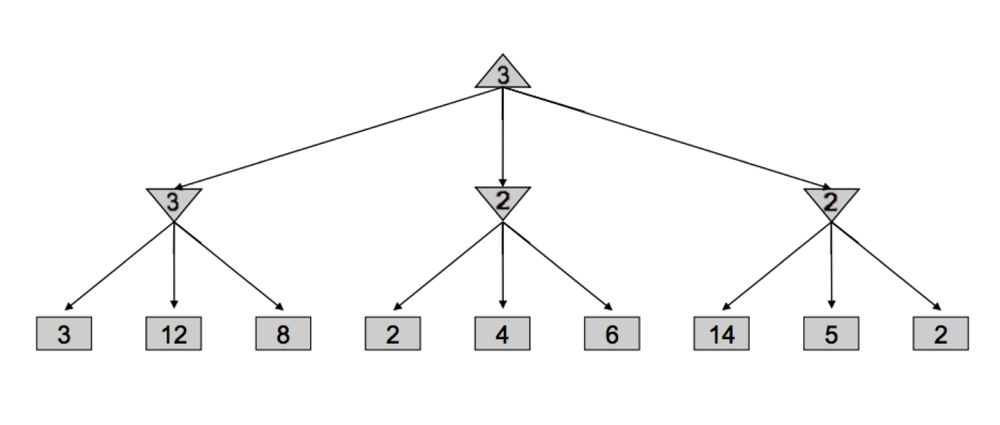

Let’s walk through how minimax derived this tree - it began by iterating through the nodes with values 3, 12, and 8, and assigning the value min(3,12,8)=3 to the leftmost minimizer. Then, it assigned min(2,4,6)=2 to the middle minimizer, and min(14,5,2)=2 to the rightmost minimizer, before finally assigning max(3,2,2)=3 to the maximizer at the root. However, if we think about this situation, we can come to the realization that as soon as we visit the child of the middle minimizer with value 2, we no longer need to look at the middle minimizer’s other children. Why? Since we’ve seen a child of the middle minimizer with value 2, we know that no matter what values the other children hold, the value of the middle minimizer can be at most 2. Now that this has been established, let’s think one step further still - the maximizer at the root is deciding between the value of 3 of the left minimizer, and the value that’s ≤2, it’s guaranteed to prefer the 3 returned by the left minimizer over the value returned by the middle minimizer, regardless of the values of its remaining children. This is precisely why we can prune the search tree, never looking at the remaining children of the middle minimizer:

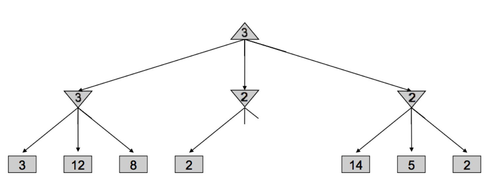

Implementing such pruning can reduce our runtime to as good as O(bm/2), effectively doubling our “solvable” depth. In practice, it’s often a lot less, but generally can make it feasible to search down to at least one or two more levels. This is still quite significant, as the player who thinks 3 moves ahead is favored to win over the player who thinks 2 moves ahead. This pruning is exactly what the minimax algorithm with alpha-beta pruning does.

The ideia is to make a new agent that uses alpha-beta pruning to more efficiently explore the minimax tree, in AlphaBetaAgent. Again, the algorithm will be slightly more general than the pseudocode, so part of the challenge is to extend the alpha-beta pruning logic appropriately to multiple minimizer agents.

Ideally, depth 3 on smallClassic should run in just a few seconds per move or faster.
```bash
python pacman.py -p AlphaBetaAgent -a depth=3 -l smallClassic
```
The AlphaBetaAgent minimax values should be identical to the MinimaxAgent minimax values, although the actions it selects can vary because of different tie-breaking behavior. Again, the minimax values of the initial state in the minimaxClassic layout are 9, 8, 7 and -492 for depths 1, 2, 3 and 4 respectively.

The pseudo-code below represents the algorithm you should implement for this question:

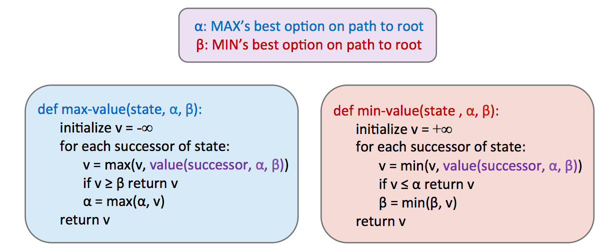

The `AlphaBetaAgent` extends the minimax implementation by carrying `alpha` and `beta` values through the recursion so branches that cannot affect the final decision are pruned. Below is a focused extract (from `multiAgents.py`) and an explanation of the pruning conditions and how they integrate with the multi-ghost sequencing and depth convention used previously.

```python
def getAction(self, gameState: GameState):
	numGhosts = gameState.getNumAgents() - 1
	return self.maximize(gameState, 1, numGhosts, float("-inf"), float("inf"))

def maximize(self, gameState, depth, numGhosts, alpha, beta):
	if gameState.isWin() or gameState.isLose():
		return self.evaluationFunction(gameState)
	maxValue = float("-inf")
	best_action = Directions.STOP
	for action in gameState.getLegalActions(0):
		successor = gameState.generateSuccessor(0, action)
		temp = self.minimize(successor, depth, 1, numGhosts, alpha, beta)
		if temp > maxValue:
			maxValue = temp
			best_action = action
		if maxValue > beta:
			return maxValue
		alpha = max(alpha, maxValue)
	if depth > 1:
		return maxValue
	return best_action

def minimize(self, gameState, depth, agentIndex, numGhosts, alpha, beta):
	if gameState.isWin() or gameState.isLose():
		return self.evaluationFunction(gameState)
	minValue = float("inf")
	for action in gameState.getLegalActions(agentIndex):
		successor = gameState.generateSuccessor(agentIndex, action)
		if agentIndex == numGhosts:
			if depth < self.depth:
				temp = self.maximize(successor, depth + 1, numGhosts, alpha, beta)
			else:
				temp = self.evaluationFunction(successor)
		else:
			temp = self.minimize(successor, depth, agentIndex + 1, numGhosts, alpha, beta)
		if temp < minValue:
			minValue = temp
		if minValue < alpha:
			return minValue
		beta = min(beta, minValue)
	return minValue
```

- **Alpha & Beta semantics:** `alpha` is the best (highest) value guaranteed to the maximizer so far on the current path; `beta` is the best (lowest) value guaranteed to the minimizer. If a maximizer node finds a value > beta, the minimizer ancestor would avoid this branch so it can be pruned. Symmetrically, if a minimizer node finds a value < alpha, the maximizer ancestor would avoid that branch.
- **Integration with multiple ghosts:** the prune checks are applied at every maximize/minimize node. Because ghosts are sequenced by `agentIndex`, pruning may cut entire subtrees of subsequent ghosts and Pacman responses, saving significant work.
- **Depth handling / return values:** identical to the minimax description — the root `maximize` returns an action; internal calls return numeric values. Depth increments only after all ghosts move and only if `depth < self.depth`.
Alpha-beta pruning does not change the minimax result; it only reduces nodes visited. Therefore, for the same evaluation function and tie-breaking, `AlphaBetaAgent` should produce the same minimax values (and equivalent actions up to tie-breaking) as `MinimaxAgent` while often evaluating fewer states.

# 4. Expectimax

Expectimax introduces chance nodes into the game tree, which instead of considering the worst-case scenario as minimizer nodes do, considers the average case. More specifically, while minimizers simply compute the minimum utility over their children, chance nodes compute the expected utility or expected value. Our rule for determining values of nodes with expectimax is as follows:

***∀agent-controlled states,V(s)=maxs′∈successors(s)V(s′)***

***∀chance states,V(s)=∑s′∈successors(s)p(s′|s)V(s′)***

***∀terminal states,V(s)=known***

In the above formulation, p(s′|s) refers to either the probability that a given nondeterministic action results in moving from state s to s′, or the probability that an opponent chooses an action that results in moving from state s to s′, depending on the specifics of the game and the game tree under consideration. From this definition, we can see that minimax is simply a special case of expectimax. Minimizer nodes are simply chance nodes that assign a probability of 1 to their lowest-value child and probability 0 to all other children. In general, probabilities are selected to properly reflect the game state we’re trying to model, but we’ll cover how this process works in more detail in future notes. For now, it’s fair to assume that these probabilities are simply inherent game properties.

The pseudocode for expectimax is quite similar to minimax, with only a few small tweaks to account for expected utility instead of minimum utility, since we’re replacing minimizing nodes with chance nodes:

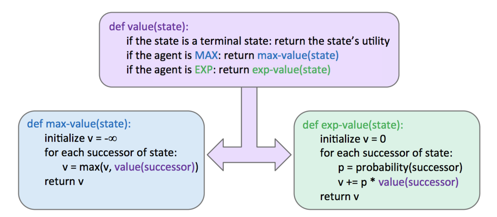

Consider the following expectimax tree, where chance nodes are represented by circular nodes instead of the upward/downward facing triangles for maximizers/minimizers.

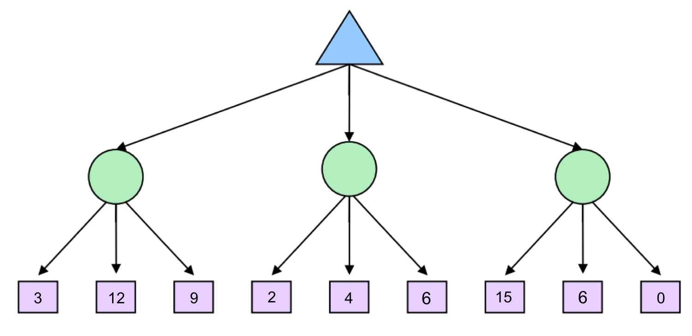

Assume for simplicity that all children of each chance node have a probability of occurrence of 13. Hence, from our expectimax rule for value determination, we see that from left to right the 3 chance nodes take on values of ***13⋅3+13⋅12+13⋅9=8***, ***13⋅2+13⋅4+13⋅6=4***, and ***13⋅15+13⋅6+13⋅0=7***. The maximizer selects the maximimum of these three values, 8, yielding a filled-out game tree as follows:

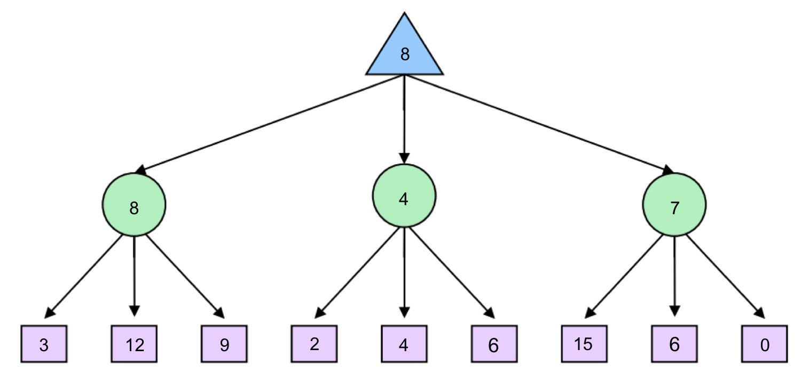

It’s important to realize that, in general, it’s necessary to look at all the children of chance nodes – we can’t prune in the same way that we could for minimax. Unlike when computing minimums or maximums in minimax, a single value can skew the expected value computed by expectimax arbitrarily high or low. However, pruning can be possible when we have known, finite bounds on possible node values.

The ExpectimaxAgent, which is useful for modeling probabilistic behavior of agents who may make suboptimal choices, when the algorithm is working on small trees, you can observe its success in Pacman. Random ghosts are of course not optimal minimax agents, and so modeling them with minimax search may not be appropriate. ExpectimaxAgent will no longer take the min over all ghost actions, but the expectation according to your agent’s model of how the ghosts act. It will only be running against an adversary which chooses amongst their getLegalActions uniformly at random.

To see how the ExpectimaxAgent behaves in Pacman, run:
```bash
python pacman.py -p ExpectimaxAgent -l minimaxClassic -a depth=3
```
You should now observe a more cavalier approach in close quarters with ghosts. In particular, if Pacman perceives that he could be trapped but might escape to grab a few more pieces of food, he’ll at least try. Investigate the results of these two scenarios:
```bash
python pacman.py -p AlphaBetaAgent -l trappedClassic -a depth=3 -q -n 10
```
```bash
python pacman.py -p ExpectimaxAgent -l trappedClassic -a depth=3 -q -n 10
```
The ExpectimaxAgent wins about half the time, while the AlphaBetaAgent always loses. Make sure you understand why the behavior here differs from the minimax case.

The implementation of expectimax will lead to Pacman losing some of the tests. This is not a problem: as it is correct behaviour, it will pass the tests.

The `ExpectimaxAgent` replaces the minimizer ghost nodes with expectation nodes that compute the expected value over ghost actions according to a model of ghost behavior (here: uniform random over legal actions). The structure and depth convention are the same as in Minimax/AlphaBeta: Pacman is the maximizer, ghosts are expanded sequentially by `agentIndex`, and `depth` counts Pacman plies (incremented only after all ghosts move).

```python
def getAction(self, gameState: GameState):
	numGhosts = gameState.getNumAgents() - 1
	return self.maximize(gameState, 1, numGhosts)

def maximize(self, gameState, depth, numGhosts):
	if gameState.isWin() or gameState.isLose():
		return self.evaluationFunction(gameState)
	bestValue = float("-inf")
	best_action = Directions.STOP
	for action in gameState.getLegalActions(0):
		successor = gameState.generateSuccessor(0, action)
		val = self.expectValue(successor, depth, 1, numGhosts)
		if val > bestValue:
			bestValue = val
			best_action = action
	if depth > 1:
		return bestValue
	return best_action

def expectValue(self, gameState, depth, agentIndex, numGhosts):
	if gameState.isWin() or gameState.isLose():
		return self.evaluationFunction(gameState)
	legalActions = gameState.getLegalActions(agentIndex)
	if not legalActions:
		return self.evaluationFunction(gameState)
	prob = 1.0 / len(legalActions)
	value = 0.0
	for action in legalActions:
		successor = gameState.generateSuccessor(agentIndex, action)
		if agentIndex == numGhosts:
			if depth < self.depth:
				value += prob * self.maximize(successor, depth + 1, numGhosts)
			else:
				value += prob * self.evaluationFunction(successor)
		else:
			value += prob * self.expectValue(successor, depth, agentIndex + 1, numGhosts)
	return value
```

- **Expectation vs Min:** Instead of taking the minimum over ghost actions, `expectValue` computes a weighted average using `prob = 1/|legalActions|`. This models random or stochastic ghost behavior rather than an adversary.
- **Depth semantics:** The `depth` variable counts Pacman and is incremented only after all ghosts have moved (when `agentIndex == numGhosts`). Internal calls return numeric values; only the root `maximize` returns an action.
- **Leaf handling:** Terminal states (win/lose) and nodes at the depth limit use `self.evaluationFunction` to score states.
- **Behavioral impact:** Expectimax can make bolder moves in risky situations (it may gamble on ghosts acting randomly and therefore sometimes escape traps to collect more food). This makes its playstyle different from minimax/alpha-beta and can improve average-case performance against random ghosts.


## 5. Evaluation Function

***Evaluation functions***, functions that take in a state and output an estimate of the true minimax value of that node. Typically, this is plainly interpreted as “better” states being assigned higher values by a good evaluation function than “worse” states. Evaluation functions are widely employed in depth-limited minimax, where we treat non-terminal nodes located at our maximum solvable depth as terminal nodes, giving them mock terminal utilities as determined by a carefully selected evaluation function. Because evaluation functions can only yield estimates of the values of non-terminal utilities, this removes the guarantee of optimal play when running minimax.

A lot of thought and experimentation is typically put into the selection of an evaluation function when designing an agent that runs minimax, and the better the evaluation function is, the closer the agent will come to behaving optimally. Additionally, going deeper into the tree before using an evaluation function also tends to give us better results - burying their computation deeper in the game tree mitigates the compromising of optimality. These functions serve a very similar purpose in games as heuristics do in standard search problems.

The most common design for an evaluation function is a linear combination of features.

***Eval(s)=w1f1(s)+w2f2(s)+...+wnfn(s)***

Each ( f_i(s) ) corresponds to a feature extracted from the input state ( s ), and each feature is assigned a corresponding weight wi. Features are simply some element of a game state that we can extract and assign a numerical value. For example, in a game of checkers we might construct an evaluation function with 4 features: number of agent pawns, number of agent kings, number of opponent pawns, and number of opponent kings. We’d then select appropriate weights based loosely on their importance. In our checkers example, it makes most sense to select positive weights for our agent’s pawns/kings and negative weights for our opponent’s pawns/kings. Furthermore, we might decide that since kings are more valuable pieces in checkers than pawns, the features corresponding to our agent’s/opponent’s kings deserve weights with greater magnitude than the features concerning pawns. Below is a possible evaluation function that conforms to the features and weights we’ve just brainstormed:

***Eval(s)=2⋅agent_kings(s)+agent_pawns(s)−2⋅opponent_kings(s)−opponent_pawns(s)***

As you can tell, evaluation function design can be quite free-form, and don’t necessarily have to be linear functions either. For example, nonlinear evaluation functions based on neural networks are very common in Reinforcement Learning applications. The most important thing to keep in mind is that the evaluation function yields higher scores for better positions as frequently as possible. This may require a lot of fine-tuning and experimenting on the performance of agents using evaluation functions with a multitude of different features and weights.

The evaluation function should evaluate states, rather than actions like your reflex agent evaluation function did. With depth 2 search, your evaluation function should clear the smallClassic layout with one random ghost more than half the time and still run at a reasonable rate (to get full credit, Pacman should be averaging around 1000 points when he’s winning).

```python
def betterEvaluationFunction(currentGameState: GameState):
    ghostStates = currentGameState.getGhostStates()
    pacmanPosition = currentGameState.getPacmanPosition()
    counter = currentGameState.getNumFood()
    score = currentGameState.getScore()
    huge = len(currentGameState.getCapsules())

    food = currentGameState.getFood()
    foodPosition = food.asList()
    foodPosition = sorted(foodPosition, key=lambda position : manhattanDistance(pacmanPosition, position))

    closestDistanceToFood = 0
    if len(foodPosition) > 0:
        closestDistanceToFood = manhattanDistance(foodPosition[0], pacmanPosition)

    closeGhost = float("inf")
    ghostEval = 0

    for ghost in ghostStates:
        ghostPosition = ghost.getPosition()
        manhattan_Distance = manhattanDistance(pacmanPosition, ghostPosition)

        if ghost.scaredTimer == 0:
            if manhattan_Distance < closeGhost:
                closeGhost = manhattan_Distance
        elif ghost.scaredTimer > manhattan_Distance:
            ghostEval += 200 - manhattan_Distance

    if closeGhost == float("inf"):
        closeGhost = 0
    ghostEval += closeGhost

    return score - 10 * counter + 1 * ghostEval * huge - 2 * closestDistanceToFood
```

The code begins by extracting information from the `GameState` that will be useful for determining how good a state is. It fetches the ghost states because whether ghosts are near or scared fundamentally changes what is safe and desirable. It fetches Pacman's position since distances to objects (food, ghosts) are computed relative to Pacman. It also reads the number of food pellets remaining into `counter` and the current environment `score` so the heuristic can combine progress toward the goal with the game’s own scoring.

Next the implementation counts power capsules and stores that count in the variable named `huge`. This value is used later as a multiplier for the ghost-related term; the intent is to make ghost-chasing behaviour more significant when capsules are present on the board, though as discussed below that multiplier is a tunable design choice.

To handle food, the function converts the food grid to a list of coordinates and sorts that list by Manhattan distance from Pacman. The first element (if any food exists) is therefore the nearest food pellet and the code computes `closestDistanceToFood` as that Manhattan distance. If there is no food left `closestDistanceToFood` remains zero. This single nearest-food distance is used to encourage movement toward the closest pellet by subtracting twice that distance from the final evaluation, so smaller distances increase the returned value.

The ghost handling is a two-part procedure. First, `closeGhost` is initialized to positive infinity and will be reduced to the minimum Manhattan distance to any non-scared ghost. This means the heuristic tracks how close the most dangerous (non-scared) ghost is. Second, a separate accumulator `ghostEval` collects bonuses for scared ghosts that are both near and reachable while they remain scared. Inside the loop over `ghostStates`, the code computes the Manhattan distance to each ghost and checks whether the ghost is scared. If a ghost is not scared and it is closer than any previously observed non-scared ghost, `closeGhost` is updated to that smaller distance. If a ghost is scared and its `scaredTimer` is greater than the Manhattan distance (loosely, the ghost will remain scared long enough to reach it), the implementation adds a reward equal to `200 - manhattan_Distance` to `ghostEval`. This reward grows when the ghost is closer and when it is certainly catchable before the scared timer expires.

After the loop, if `closeGhost` was never updated it is set to zero so it does not remain an infinite value. The current value of `closeGhost` is added into `ghostEval` so that ghost-related considerations include both the distance to the nearest active ghost and any large positive incentives to chase scared ghosts.

Finally, the function returns a linear combination of the features. It starts with the built-in `score`, subtracts `10 * counter` to penalize remaining food strongly, adds the product `ghostEval * huge` (so ghost-related incentives are amplified in proportion to how many capsules remain), and subtracts `2 * closestDistanceToFood` to encourage closing on the nearest pellet. In effect, the returned number balances safety, immediate opportunities to eat scared ghosts, and progress toward clearing the board.

The specific numeric choices are pragmatic and intended to produce a certain style of play rather than to be universally optimal. The `-10 * counter` term gives a heavy reward for reducing the number of remaining pellets; that makes the agent prioritize finishing the level, sometimes at the cost of taking riskier moves. The `200 - manhattan_Distance` bonus for reachable scared ghosts is deliberately large to make chasing edible ghosts attractive, but if that leads the agent to risk death, the constant can be reduced. The multiplication of `ghostEval` by `huge` aggressively increases ghost-chasing incentives when capsules are present, but it also means ghost considerations vanish when no capsules remain; changing this multiplier to a boolean indicator (there are capsules or not) or to a different function of remaining capsules may give more consistent behaviour across different maps.

In practice, small refinements can improve robustness: replacing the single nearest-food distance with a combination of the k nearest foods or with a sum of inverse distances reduces myopic actions; normalizing distances by map size keeps weights portable between layouts; and explicitly penalizing immediate ghost proximity with a very large negative value ensures the agent values survival above small gains. Running the autograder or playing a number of automated games while sweeping the key constants (`10`, `200`, `2`) will reveal which adjustments produce the best trade-off for your testing layouts.


